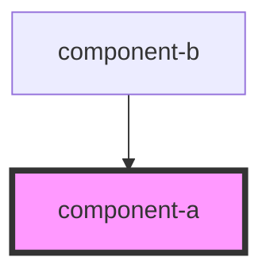

# component-a

<!-- Auto Generated Below -->

## Dependencies

### Used by

 - [component-b](../component-b)

### Graph

----------------------------------------------

*Built with [StencilJS](https://stenciljs.com/)*
