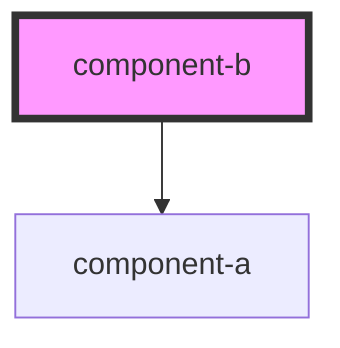

# component-b

<!-- Auto Generated Below -->

## Dependencies

### Depends on

- [component-a](../component-a)

### Graph

----------------------------------------------

*Built with [StencilJS](https://stenciljs.com/)*
